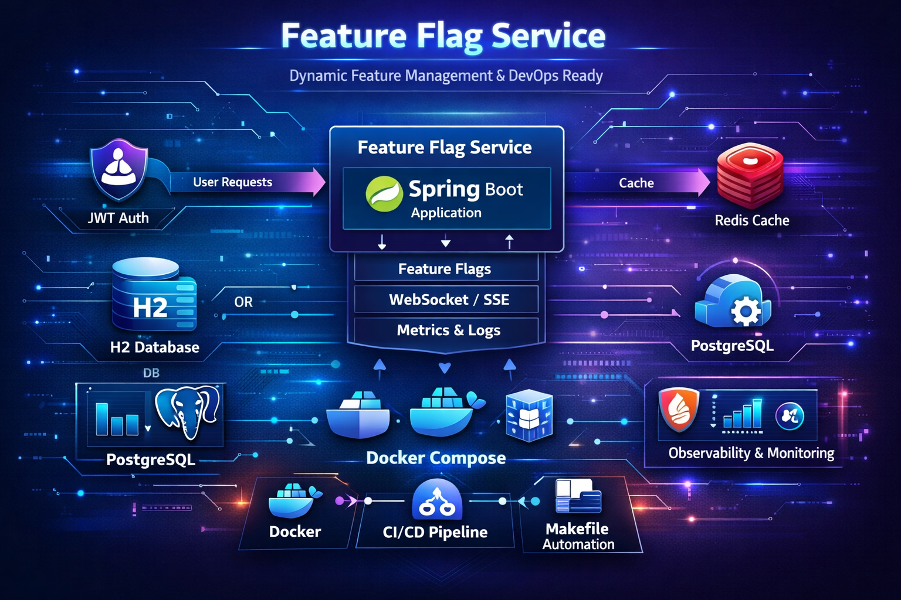
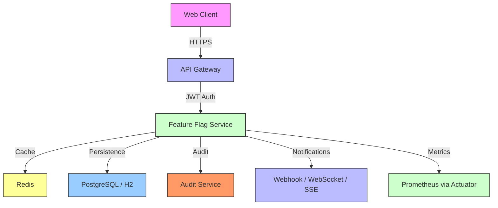

# 🚀 Feature Flag Service

**Servicio de gestión de features dinámicas con Spring Boot 3.x | Java 21 | DevOps Pro**

*Para ver la portada completa, visita el repositorio en [github.com/raulrodriguezmesia-blip/springboot-feature-flag](https://github.com/raulrodriguezmesia-blip/springboot-feature-flag).*

---

## 📢 Descripción General

El **Feature Flag Service** es un microservicio Spring Boot 3.x que permite activar/desactivar funciones en tiempo real sin necessidade de redploy. Integra:
- **Seguridad**: JWT (con refresh tokens) y control de roles (ADMIN/USER).
- **Caché**: Redis (con fallback en memoria).
- **Observabilidad**: Actuator + Prometheus + JSON estructurado.
- **Actualizaciones en tiempo real**: WebSocket/SSE.

---

## 🔮 Arquitectura Técnica



---

## 📊 Componentes de Despliegue

### 1. `Dockerfile` (Multi-stage)
```dockerfile
FROM eclipse-temurin:21-jdk-alpine AS build
WORKDIR /app
COPY ./pom.xml .\nRUN mvn dependency:go-offline
COPY ./src/main ./src/main
RUN mvn clean package -DskipTests

FROM eclipse-temurin:21-jre-alpine
WORKDIR /app
COPY --from=build /app/target/*.jar app.jar
EXPOSE 8080
ENTRYPOINT ["java","-jar","app.jar"]
```

---

## ⏳ Beneficios Técnicos

| Característica      | Valor            |
|----------------------|------------------|
| **Flexibilidad**     | Desactivar/activar features en runtime. |  