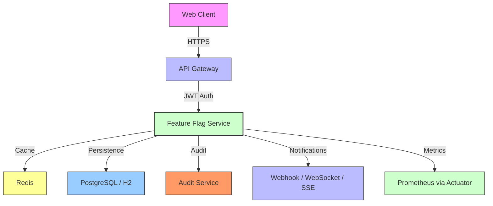

# 🚀 Feature Flag Service

**Spring Boot 3.x microservice for dynamic feature flag management**

A production‑ready microservice that enables toggling application features at runtime without redeployments. Built with **Spring Boot 3.x** and **Java 21**, it combines enterprise‑grade security, observability, and cloud‑native deployment tooling.

---

## 📖 Overview

The **Feature Flag Service** provides a flexible, secure, and observable way to manage feature toggles in modern Java applications. Key capabilities include:

- **Runtime Feature Management** – Enable/disable flags via REST API or WebSocket
- **Enterprise Security** – JWT with refresh tokens, OAuth2 integration, role‑based access
- **High‑Performance Caching** – Redis (with in‑memory fallback) for low‑latency flag evaluation
- **Persistent Storage** – PostgreSQL (production) / H2 (development) for flag state
- **Observability** – Actuator endpoints, Prometheus‑compatible metrics, structured JSON logging
- **Real‑Time Updates** – WebSocket & Server‑Sent Events (SSE) for live flag change notifications
- **Auditable Changes** – Immutable audit trails with webhook integration

---

## 🏗️ Technical Architecture (Spring Boot 3 + Java 21)



### Core Components
| Component | Responsibility |
|-----------|-----------------|
| **FeatureFlagController** | REST API for CRUD operations on flags |
| **WebSocketService** | Pushes real‑time updates to connected clients |
| **JwtAuthenticationFilter** | Stateless authentication with refresh‑token rotation |
| **AuditService** | Immutable change logging + webhook notifications |
| **RedisCache** | Low‑latency flag evaluation cache |
| **Actuator / Prometheus** | Exposes `/actuator/metrics` and `/actuator/health` |

---

## 📦 Deployment Artifacts

### 🐳 Dockerfile (Multi‑Stage Build)
```dockerfile
# Build stage
FROM eclipse-temurin:21-jdk-alpine AS builder
WORKDIR /app
COPY ./pom.xml .
RUN mvn dependency:go-offline -q
COPY ./src ./src
RUN mvn clean package -DskipTests

# Runtime stage
FROM eclipse-temurin:21-jre-alpine
WORKDIR /app
COPY --from=builder /app/target/*.jar app.jar
EXPOSE 8080
ENTRYPOINT ["java","-jar","app.jar"]
```

### 📂 docker‑compose.yml (Local/K8s‑Ready)
```yaml
version: "3.9"
services:
  feature-flag-service:
    build: .
    ports: ["8080:8080"]
    environment:
      - SPRING_PROFILES_ACTIVE=docker
    depends_on:
      - redis
      - postgres
  redis:
    image: redis:7-alpine
    ports: ["6379:6379"]
  postgres:
    image: postgres:15
    environment:
      POSTGRES_DB: featureflags
      POSTGRES_USER: user
      POSTGRES_PASSWORD: password
    ports: ["5432:5432"]
```

### 🛠️ Makefile (One‑Command Automation)
```makefile
.PHONY: build up down logs test

build:
	@docker build -t feature-flag-service .

up:
	@docker-compose up -d

down:
	@docker-compose down -v

logs:
	@docker-compose logs -f

test:
	@./mvnw test
```

---

## ⚡ Quick‑Start Guide

```bash
# 1️⃣ Clone the repo
git clone https://github.com/raulrodriguezmesia-blip/springboot-feature-flag.git
cd springboot-feature-flag

# 2️⃣ Build the Docker image
make build

# 3️⃣ Start all services
make up

# 4️⃣ Verify health endpoint
curl http://localhost:8080/actuator/health

# 5️⃣ Obtain an admin JWT token
curl -X POST http://localhost:8080/api/login \
  -H "Content-Type: application/json" \
  -d '{"username":"admin","password":"securepassword"}'

# 6️⃣ Create a feature flag (use the returned token)
curl -X POST "http://localhost:8080/api/feature-flags?key=betaFeature&enabled=true" \
  -H "Authorization: Bearer <YOUR_JWT>"
```

---

## 📈 Benefits & Value

| Benefit | How It’s Achieved |
|---------|-------------------|
| **Flexibility** | Toggle features on/off without redeploying |
| **Scalability** | Stateless services + Redis caching |
| **Security** | JWT with refresh tokens, BCrypt password encoding, role‑based access |
| **Observability** | Actuator + Prometheus metrics, structured logging |
| **Automation** | GitHub Actions CI/CD pipeline, Makefile for devops tasks |
| **Production‑Ready** | Multi‑stage Docker image (~90 MB), Helm‑compatible charts, health checks |

---

## 🚀 CI/CD & Production Readiness

- **GitHub Actions**: Automated builds, unit‑test execution, Docker image publishing, and Helm chart deployment on push to `master`.
- **Monitoring**: `/actuator/prometheus` exposes metrics for Grafana dashboards.
- **Health Checks**: `/actuator/health` and `/actuator/info` for Kubernetes liveness/readiness probes.
- **Security Scanning**: Dependabot alerts integrated via GitHub security alerts.

---

## 📂 Repository Structure

```
├── README.md                 # Project overview & instructions
├── Dockerfile                # Multi‑stage build
├── docker-compose.yml        # Local orchestration
├── Makefile                  # DevOps automation
├── pom.xml                   # Maven build config
├── src
│   └── main
│       └── java
│           └── com.example.featureflag
│               ├── controller       # REST endpoints
│               ├── service          # Business logic
│               ├── cache            # Redis integration
│               └── security         # JWT & auth
└── .github/workflows/ci-cd.yml # CI/CD pipeline
```

---

## 📞 Contact & Contributions

- **Author**: Raul Rodriguez Mesía – Senior Java Engineer (DevOps focus)  
- **Open Issues**: Feel free to open a PR for enhancements, bug‑fixes, or documentation updates.  
- **License**: MIT – see `LICENSE` file for details.

---

**Ready for production.** 🎉  
[](https://github.com/raulrodriguezmesia-blip/springboot-feature-flag)