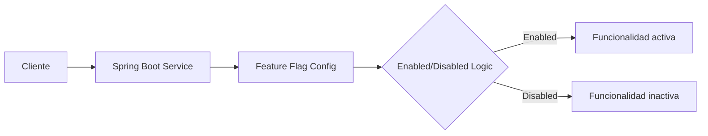

# 🚀 Spring Boot Feature Flag Service

[]()
[]()
[]()
[]()
[]()
[]()

[](https://linkedin.com/in/raul-rodriguez-mesia-bb8178149)
[](https://github.com/raulrodriguezmesia-blip/springboot-feature-flag)

---

## 💼 Contexto profesional

Microservicio que implementa **feature flags dinámicos sin redeploy**, demostrando:

- ✅ **Backend avanzado**: Java 17 + Spring Boot 3 + Clean Architecture
- ✅ **Configuración dinámica**: Control de funcionalidades en tiempo real
- ✅ **CI/CD integral**: GitHub Actions + Docker + Kubernetes-ready
- ✅ **Observabilidad**: Actuator + Prometheus + Health Checks
- ✅ **Seguridad enterprise**: JWT + Role-Based Access Control

Primer proyecto de un portafolio orientado a microservicios escalables.

---

## ⚙️ Arquitectura

### Diagrama ASCII
```
[Cliente] ---> [Spring Boot Service] ---> [Feature Flag Config]
                                   |
                                   ---> [Enabled/Disabled Logic]
```

### Diagrama Mermaid


---

## 🛠️ Instalación y ejecución

### Con Docker Compose (recomendado)
```bash
git clone https://github.com/raulrodriguezmesia-blip/springboot-feature-flag.git
cd springboot-feature-flag
make build
make up
curl http://localhost:8080/actuator/health
```

### Con Maven
```bash
mvn clean install
mvn spring-boot:run
```

### Con Kubernetes
```bash
helm install feature-flag ./helm-chart/feature-flag-service
```

---

## 🎥 Demo

### Endpoints
```bash
# Activar feature flag
curl -X POST "http://localhost:8080/api/feature-flags?key=newDashboard&enabled=true" \
  -H "Authorization: Bearer <JWT_TOKEN>"

# Verificar estado
curl http://localhost:8080/api/feature-flags/newDashboard \
  -H "Authorization: Bearer <JWT_TOKEN>"
# Resultado: true o false
```

### Video Showcase
[](https://github.com/raulrodriguezmesia-blip/springboot-feature-flag/raw/master/presentation/feature-showcase.mp4)

---

## 📅 Roadmap futuro

| Proyecto | Tecnologías | Estado |
|----------|-------------|--------|
| **Event-Driven Notification Service** | Kafka + WebSocket | 🔜 |
| **Observability Dashboard** | Prometheus + Grafana + Loki | 🔜 |
| **Microservice Template** | Spring Boot + Helm + CI/CD | 🔜 |
| **Multi-cloud Deployment Guide** | Terraform + AKS + GKE | 🔜 |

---

## 🧰 Tecnologías usadas

| ☕ Java 17 | 🍃 Spring Boot 3 | Ⓜ️ Maven | 🐳 Docker | ☁️ AWS | 🎯 Helm | 📋 GitHub Actions |
|:---:|:---:|:---:|:---:|:---:|:---:|:---:|

---

## 💡 Valor profesional

Este proyecto demuestra experiencia en:

- ✅ Feature flags en microservicios
- ✅ Arquitectura cloud-native
- ✅ DevOps: CI/CD + Containers + Kubernetes
- ✅ Seguridad: JWT + RBAC
- ✅ Observabilidad: Métricas + Health Checks

---

## 📬 Contacto

**Raúl Rodriguez Mesia** - Backend Developer  
Especialista en Java, Spring Boot, AWS, Docker, CI/CD

[](https://github.com/raulrodriguezmesia-blip)
[](https://linkedin.com/in/raul-rodriguez-mesia-bb8178149)

**Licencia**: MIT
